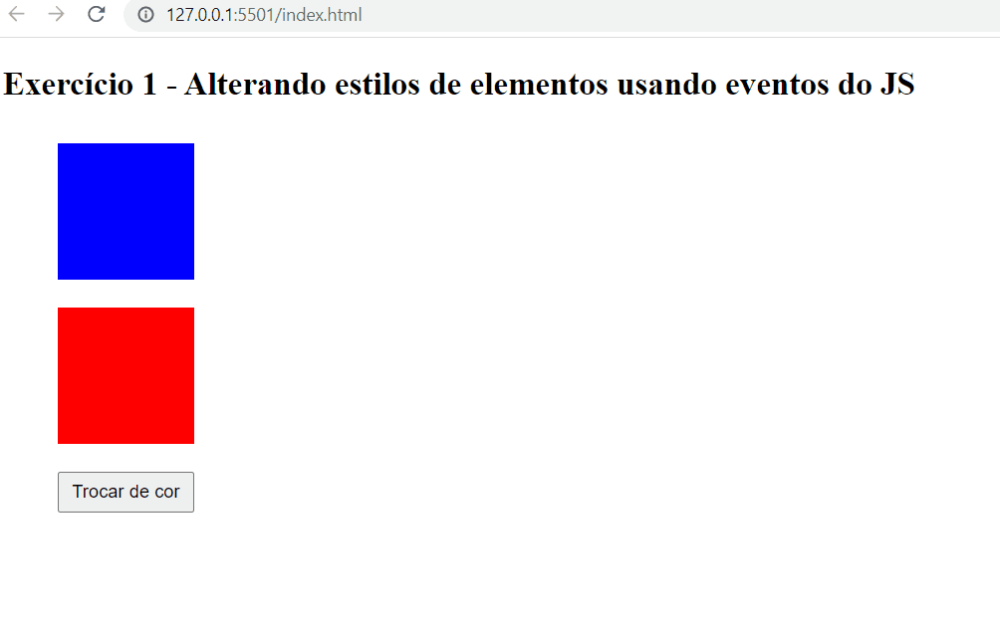

## Exercício 1 de JavaScript Intermediário ⚔

## Descrição da tarefa:
Criar 2 quadrados na tela usando HTML e CSS. O primeiro quadrado deve ter a cor de fundo azul e o segundo a cor de fundo vermelha. Além disso você deve adicionar um botão na tela com a label “Trocar de cor” e ao clicar no botão somente o quadrado azul deve ter sua cor alterada para amarelo.

## Conteúdos colocados em prática ❗

- Alteração de estilos de elementos usando JS:
Pude utilizar métodos de manipulação do DOM através do document com o getElementById, além de realizar consulta com o querySelector, e também realizei a adição de evento de click com o addEventListener e função que remove e adiciona classe de um elemento seguindo a lógica necessária para conclusão do exercício proposto.

## Tecnologias utilizadas 💻

 
    
    
    
    

## Como testar os comandos ❓
Primeiramente deve-se clonar este repositório no git bash com o comando: git clone url do repositório

Após isso, você terá acesso as pastas com todos os aquivos utilizados para a realização do exercício. Basta abrir a pasta com o VsCode ou seu editor de código específico.

Feito isso, basta seguir os passos a seguir:

1️⃣ Dentro do seu navegador, clicando com o botão direito, escolhendo a opção “Inspecionar” e a aba “Console”. Basta copiar e colar cada uma das linha de código.

2️⃣ Ou se o seu editor de código for o VsCode, dentro arquivo HTML basta utilizar o atalho alt + l + o que através da extensão Live Server irá ser executado os códigos e exibido diretamente no console do seu navegador.

## Vizualização:
[]
