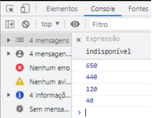

## Exercício 2 de JavaScript Intermediário ⚔

## Descrição da tarefa:
Criar um array com os seguintes números: 65, 44, 12 e 4. Após a criação, deverá utilizar o laço de repetição forEach para percorrer os itens e realizar a multiplicação de cada um por 10. Pode apresentar o resultado de cada multiplicação usando o console.log().

## Conteúdos colocados em prática:

- Multiplicando itens de um array usando o ForEach:
Pude colocar em prática a criação de arrays, utilizando o array criado para executar um laço com ForEach, nele, utilizei uma variável para iterar cada elemento do array. Por fim, com o console.log imprimi na tela os elementos já multiplicados por 10.

## Tecnologias utilizadas

 
    
    
    
    

## Como testar os comandos? 
Primeiramente deve-se clonar este repositório no git bash com o comando: git clone url do repositório

Após isso, você terá acesso as pastas com todos os aquivos utilizados para a realização do exercício. Basta abrir a pasta com o VsCode ou seu editor de código específico.

Feito isso, basta seguir os passos a seguir:

1️⃣ Dentro do seu navegador, clicando com o botão direito, escolhendo a opção “Inspecionar” e a aba “Console”. Basta copiar e colar cada uma das linha de código.

2️⃣ Ou se o seu editor de código for o VsCode, dentro arquivo HTML basta utilizar o atalho alt + l + o que através da extensão Live Server irá ser executado os códigos e exibido diretamente no console do seu navegador.

## Vizualização do resultado:
[]