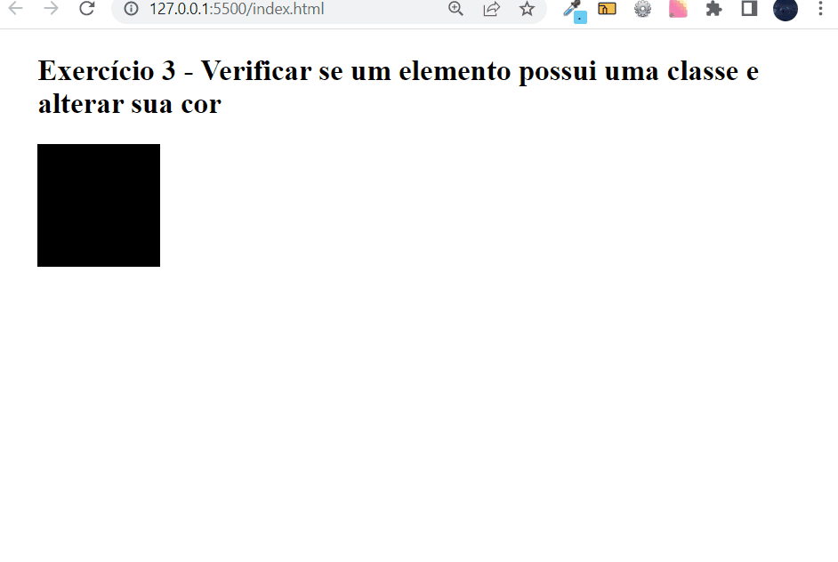

## Exercício 3 de JavaScript Intermediário ⚔

## Descrição da tarefa:
Ao clicar no quadrado na tela, deve verificar se ele tem a classe azul.  Se tiver, deve alterar a cor do quadrado para a cor azul e mostrar um alerta com o texto “Esse quadrado TEM a classe azul!”. Se já possuir a cor azul, deve remover a cor azul, deixando a cor original. 
## Objetivo do exercício:
Verificar se o elemento possui uma classe, se não tiver deverá ser adicionada. Caso existir, remover essa classe.

## Conteúdos colocados em prática:
Realizar verificação para saber se um elemento possui uma determinada classe e alterar sua cor:

Pude colocar em prática a manipulação do DOM através do document, utilizando o querySelector para realizar uma consulta no elemento 'quadrado', além de adicionar evento de click com o addEventListener, pude criar uma arrow function para no momento do click ocorrer a verificação da existência da classe 'azul' no elemento, também foi criado uma condicional para remover e adicionar a classe desejada dependendo da condição.E por fim, é exibido um alert com uma mensagem dizendo que o elemento tem a classe 'azul'.

## Tecnologias utilizadas

 
    
    
    
    

## Como testar os comandos? 
Primeiramente deve-se clonar este repositório no git bash com o comando: git clone url do repositório

Após isso, você terá acesso as pastas com todos os aquivos utilizados para a realização do exercício. Basta abrir a pasta com o VsCode ou seu editor de código específico.

Feito isso, basta seguir os passos a seguir:

1️⃣ Dentro do seu navegador, clicando com o botão direito, escolhendo a opção “Inspecionar” e a aba “Console”. Basta copiar e colar cada uma das linha de código.

2️⃣ Ou se o seu editor de código for o VsCode, dentro arquivo HTML basta utilizar o atalho alt + l + o que através da extensão Live Server irá ser executado os códigos e exibido diretamente no console do seu navegador.

## Vizualização do resultado:
[]
