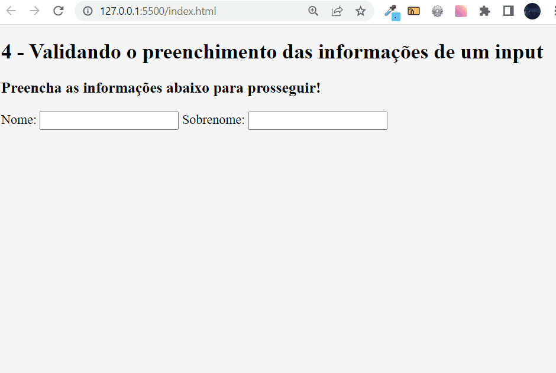

## Exercício 4 de JavaScript Intermediário: Validando o preenchimento das informações de um input ⚔

## Descrição da tarefa:
Deve ser criado um ou mais inputs na tela. Ao digitar qualquer texto em um desses inputs, a sua borda deverá ficar com a cor verde. Caso o input estiver vazio, a cor da borda deverá voltar ao normal.

## Objetivo do exercício:
Ao preencher alguma informação nos inputs, deve ser verificado se estão vazios ou não. 
Caso tiver algum valor, será adicionada a borda verde. Se não tiver, é removida a borda.

## Conteúdos colocados em prática:
Validar o preenchimento das informações em um input:

Pude colocar em prática a manipulação do DOM através do document, utilizando o querySelectorAll para pegar os elementos que possuem a mesma classe;

Utilizei o laço de repertição forEach para percorrer cada um dos inputs;

Disparei um evento 'change' para verificar se o input foi alterado quando o usuário preencheu algo;

Com uma condicional if, dicionei a classe 'campo-preenchido' quando o  usuário adicionou algum texto no input, esta classe altera a cor da borda do input para verde;

E por fim, com a condicional else, se o input estiver vazio, será removido a classe 'campo-preenchido';

## Tecnologias utilizadas

 
    
    
    
    

## Como testar os comandos? 
Primeiramente deve-se clonar este repositório no git bash com o comando: git clone url do repositório

Após isso, você terá acesso as pastas com todos os aquivos utilizados para a realização do exercício. Basta abrir a pasta com o VsCode ou seu editor de código específico.

Feito isso, basta seguir os passos a seguir:

1️⃣ Dentro do seu navegador, clicando com o botão direito, escolhendo a opção “Inspecionar” e a aba “Console”. Basta copiar e colar cada uma das linha de código.

2️⃣ Ou se o seu editor de código for o VsCode, dentro arquivo HTML basta utilizar o atalho alt + l + o que através da extensão Live Server irá ser executado os códigos e exibido diretamente no console do seu navegador.

## Vizualização do resultado:
[]